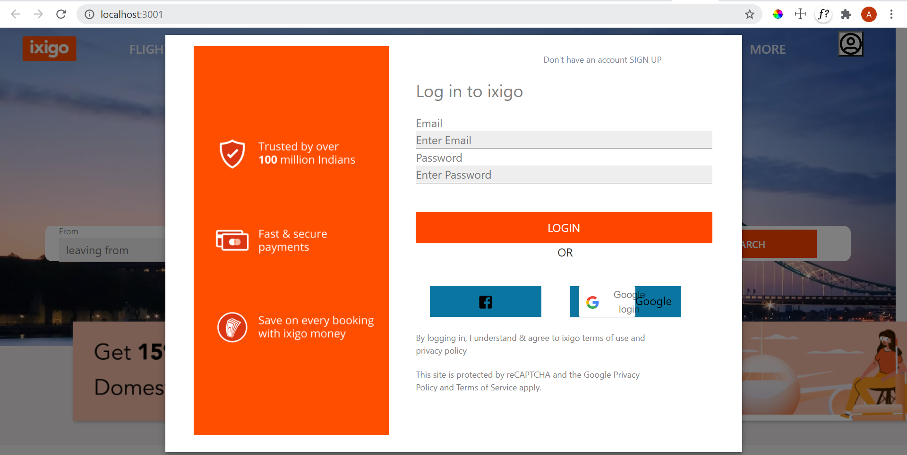
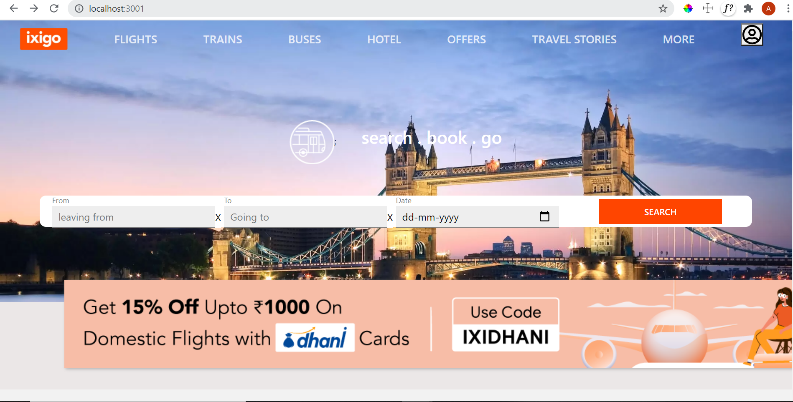
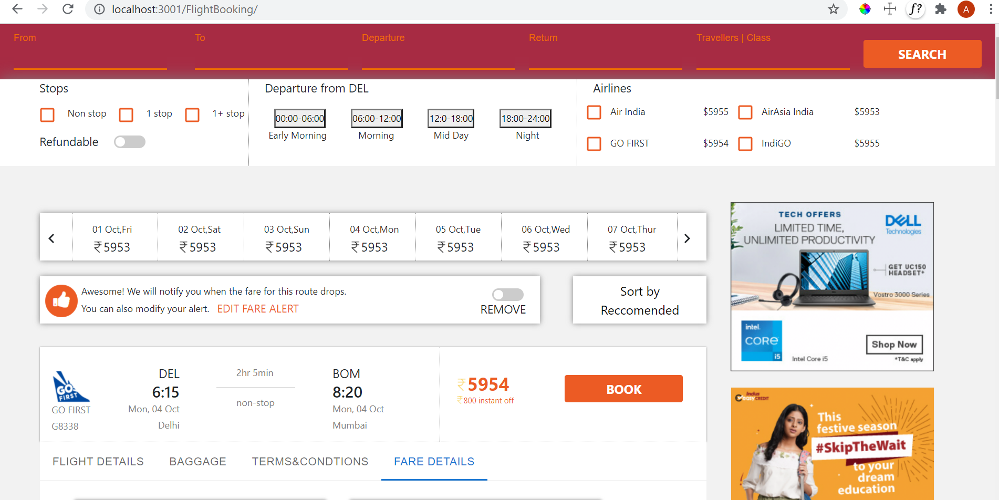
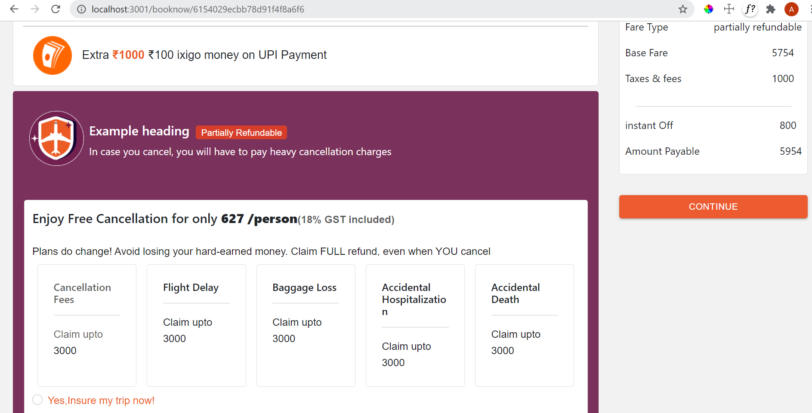
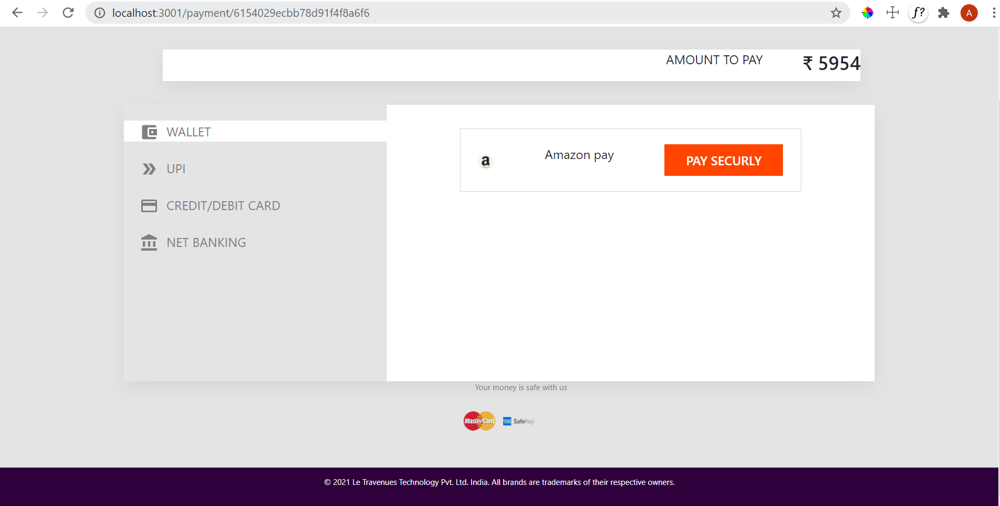

# ixigo Clone
As a part of our build week we were given a problem statement to clone the website ixigo.com in a span of 5 days.

## Team Size
4

## Team Members
1. Jagadish Hospet
2. Safiur Rahaman
3. Ananthu Asokkumar
4. Kishan Kumar

## About Project
ixigo is an Indian AI-based online travel portal, launched in 2007. Headquartered in Gurgaon, ixigo aggregates and compares real-time travel information, prices and availability for flights, trains, buses, and hotels, and allows ticket booking through its associate websites and apps.We have tried to clone the website to with all fuctionalities.

## Build With
* React JS
* Redux
* MAterial UI
* Bootstrap
* NodeJS
* Express
* MongoDB(Database)

## Pre-requisites
#### Clone the repo:
        git clone repo_link
#### Create branches 
        git checkout -b branch_name
#### Adding the files:
        git add filename
#### Commiting the changes:
        git commit -m "description"
#### Pushing the commits: 
        git push origin branch_name
#### Pulling the changes 
        git pull origin branch_name
#### Dependencies used
        * cors: ^2.8.5,
        * express: ^4.17.1,
        * moment: ^2.29.1,
        * mongoose: ^5.11.15,
        * nodemon: ^2.0.12,
        *emotion/react: ^11.4.1,
        *@emotion/styled: ^11.3.0,
        *@material-ui/core: ^4.12.3,
        *@material-ui/icons: ^4.11.2,
        *@mui/icons-material: ^5.0.1,
        *@mui/lab": ^5.0.0-alpha.49,
        *@mui/material: ^5.0.1,
        *@testing-library/jest-dom: ^5.14.1,
        *@testing-library/react: ^11.2.7,
        *@testing-library/user-event: ^12.8.3,
        *axios: ^0.22.0,
        *bootstrap: ^5.1.3,
        *react: ^17.0.2,
        *react-bootstrap": ^2.0.0-rc.1,
        *react-dom: ^17.0.2,
        *react-google-login: ^5.2.2,
        *react-icons: ^4.3.1,
        *react-phone-number-input: ^3.1.35,
        *react-redux": ^7.2.5,
        *react-router-dom: ^5.3.0,
        *react-scripts: 4.0.3,
        *react-slick: ^0.28.1,
        *react-step-progress: ^1.0.3,
        *react-step-progress-bar: ^1.0.3,
        *redux-thunk: ^2.3.0,
        *slick-carousel: ^1.8.1,
        *styled-components: ^5.3.1,
        *web-vitals: ^1.1.2
        
  
## Core Functionalities
* Login/Signup
* Google signup
* Flights Page
* Search for flights
* Filtering flights by arirlines and on basis of stops.
* Booking Page of flights
* Checkout
* Payment page

# Quick Tour to our Project
1.This is our login modal

2. This is the langing page of our website.

2. This the flights page where the user can find and filter the flights according to their preference.

3. On selecting the flight it will take you to the booking page.

4. After adding details of traveller ,the user can go to the checkout details , on click of checkout will take 
the user to payments page.This is the payment gateway where the user has to provide the card details and make the payment and confir their tickets.

5. Once the payment is done and the order is successfully placed and it will redirect from the payment page and after 3 seconds it will redirect the user to the home page of the website.

